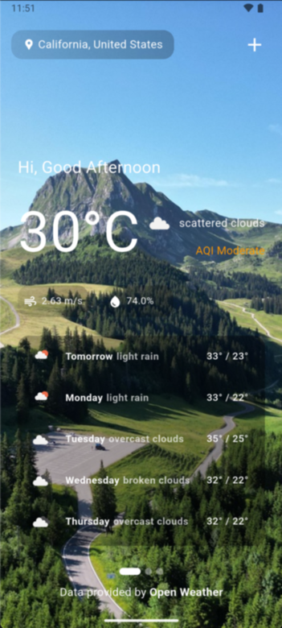
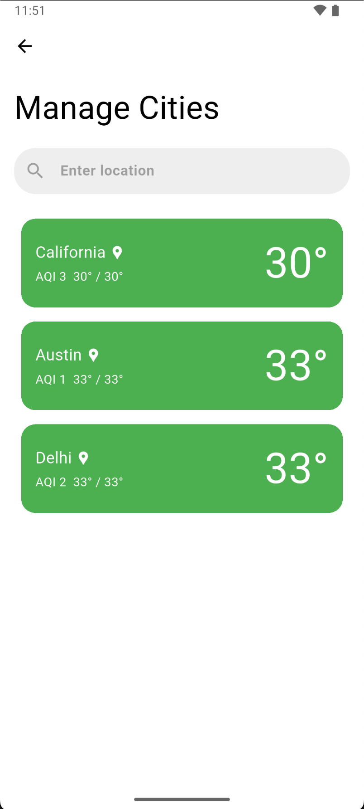
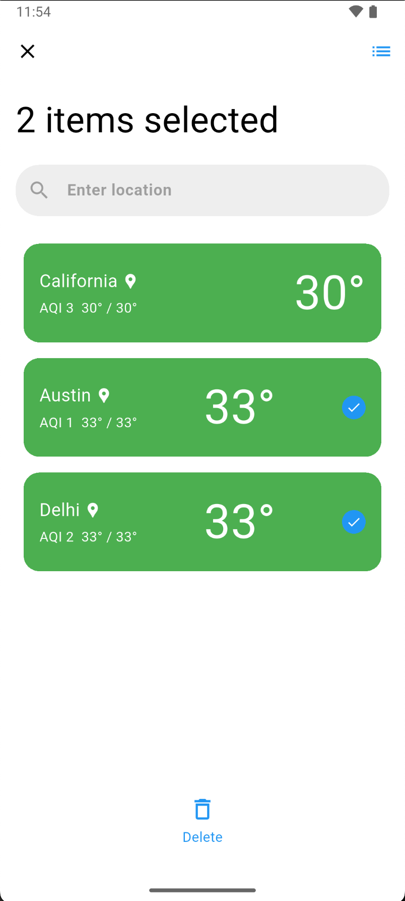

# 🌤️ Weather App

A simple and elegant Flutter-based Android weather app that displays the current weather and a 5-day forecast for any city in the world.

---

## 📋 Prerequisites

Before running the app, make sure you have the following installed and configured:

1. **Flutter SDK**  
   [Install Flutter](https://docs.flutter.dev/get-started/install)

2. **Code Editor**  
   Recommended: VS Code / Android Studio / IntelliJ

3. **API Keys**  
   - [OpenWeatherMap API Key](https://openweathermap.org/)  
   - [GeoApify API Key](https://www.geoapify.com/)

---

## 🚀 Installation

```bash
git clone https://github.com/anshgupta2403/weather_app.git
cd weather_app
```

---

## 🧩 Features

- ✅ Auto-detects current location and fetches live weather data  
- ✅ Search and add any city worldwide  
- ✅ Delete manually added cities  
- ✅ View detailed weather information, including:  
  - 🌡️ Temperature (current, min, max)  
  - 💨 Air Quality Index (AQI)  
  - 💧 Humidity  
  - 🌬️ Wind speed  
- ✅ 5-day weather forecast with easy navigation

---

## ▶️ How to Run

1. Navigate to the project directory:

   ```bash
   cd weather_app
   ```

2. Create a `.env` file at the project root and copy the contents of `.env.example` into it.

3. Add your actual API keys to the `.env` file:
   ```
   OPENWEATHER_API_KEY=your_openweather_key
   GEOAPIFY_API_KEY=your_geoapify_key
   ```

4. Get the dependencies:

   ```bash
   flutter pub get
   ```

5. Run the app:

   ```bash
   flutter run
   ```

---

## 📱 Screenshots

<div align="left">

<table>
  <tr>
    <td></td>
    <td></td>
  </tr>
  <tr>
    <td></td>
    <td></td>
  </tr>
</table>

</div>

---

## 🛠️ Tech Stack

- Flutter
- Provider (State Management)
- OpenWeatherMap API
- GeoApify API
- Shared Preferences

---

## 📄 License

This project is open-source and available under the [MIT License](LICENSE).
